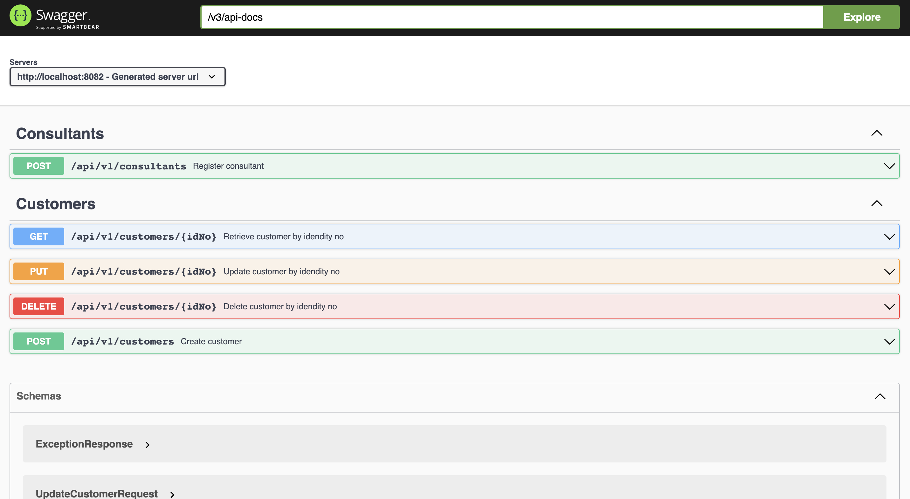
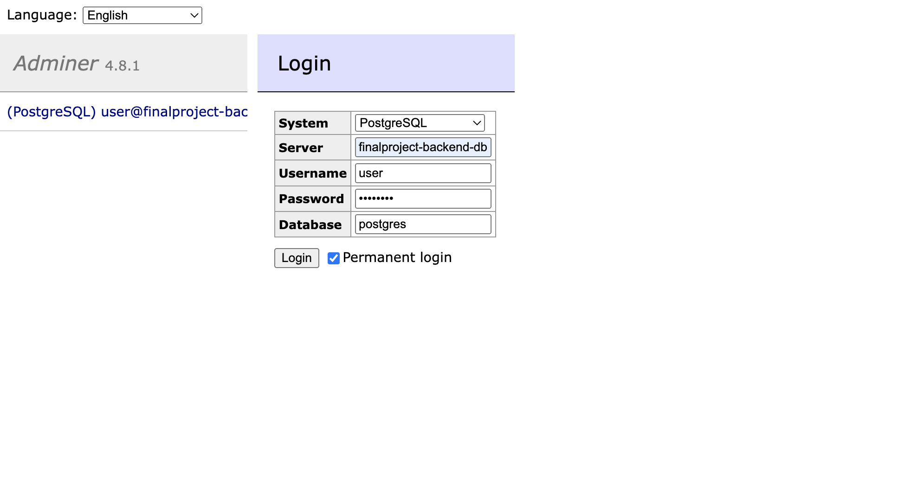
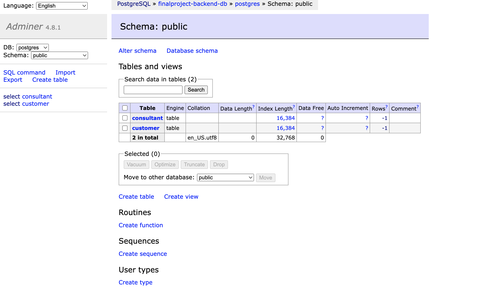
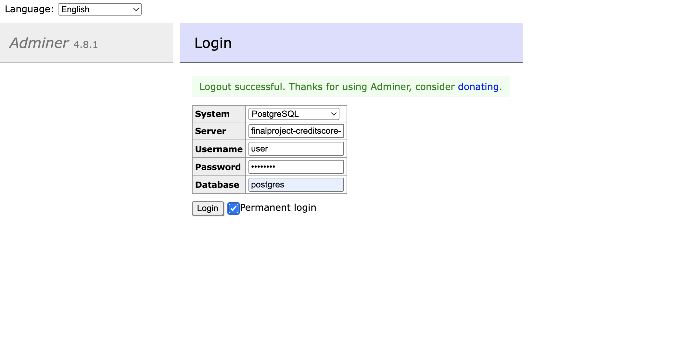
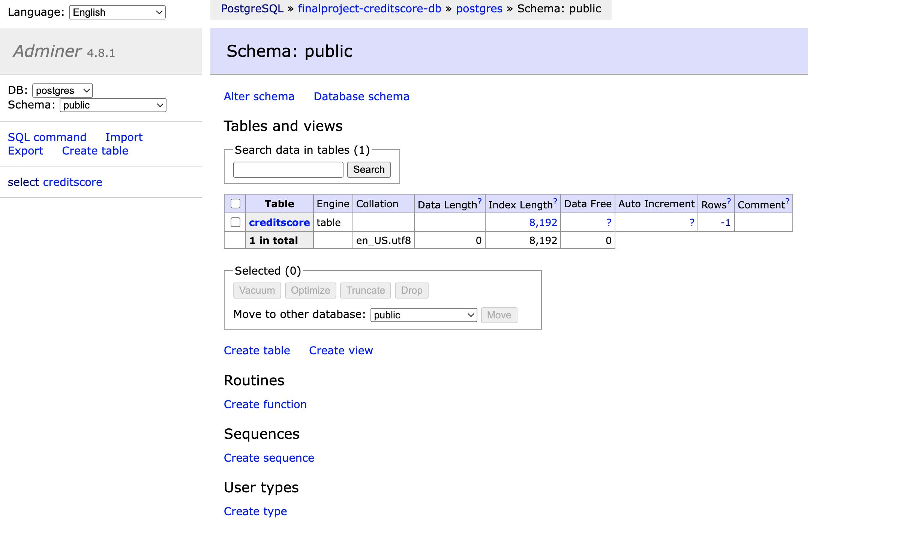
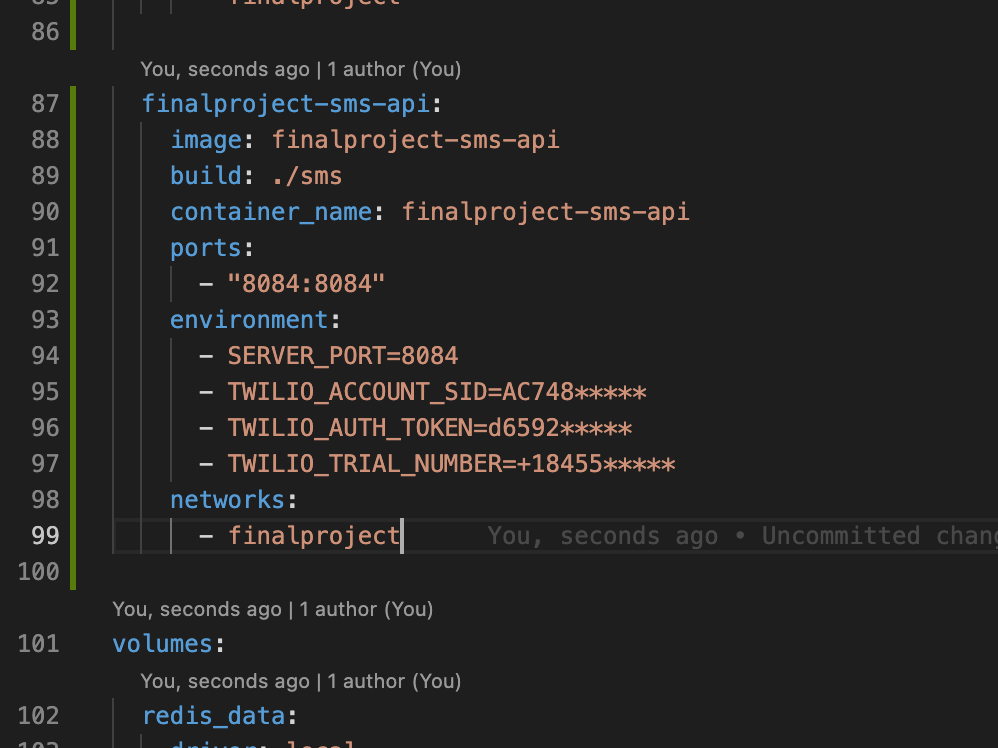
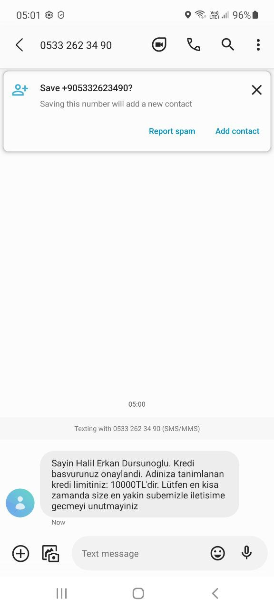

# Payten Java Spring Bootcamp Final Projesi

## Proje Hakkında

Proje hakkında detaylı bilgi için şu dokümanı inceleyiniz. -> [Payten Java Spring Bootcamp Bitirme Projesi Dosyası]()

## Projede Kullanılanlar Teknolojiler

- Java 11
- Spring
- Spring Data Jpa
- Postgres
- Redis
- Swagger
- Maven
- Docker

## Projenin Mimarisi ve Kullanılan Örüntüler

Daha geniş kapsamdan daha özele doğru sıralamak gerekirse:

- Microservice Architecture
- Hexagonal Architecture
- Strategy Design Pattern

## Projeyi Çalıştırmadan Önce

Bilgisayarınızda Java ve Maven'in kurulu olmasının gerekliliği yanında projenin kurgusu Docker ile geliştirme yapmak üzerine inşa edildiği için bilgisayarınıza Docker kurulumu yapmanız da gerekmektedir.

Ayrıca projeyi çalıştırmak için gerekli komutlar çeşitli Bash Script'ler altında toplandı. Bu sebeple bilgisayarınızda Bash Shell bulunması gerekmektedir.

## Projenin Çalıştırılması

Projenin kök dizinindeyken terminalinizde aşağıdaki komutu çalıştırınız:

```bash
sh infra-dev-up.sh
```

Projeyi terminalde <kbd>Ctrl</kbd> + <kbd>C</kbd> ile durdurduktan sonra oluşturulan Docker image'ları kaldırmak için aşağıdaki komutu çalıştırınız:

```bash
sh infra-dev-down.sh
```

## Testlerin Çalıştırılması

Testleri çalıştırmak için aşağıdaki komutu çalıştırınız:

```bash
sh infra-test-up.sh
```

Testleri çalıştırmak için oluşturulan Docker image'leri kaldırmak için aşağıdaki komutu çalıştırınız:

```bash
sh infra-test-down.sh
```

## Swagger

<http://localhost:8082/swagger-ui/index.html#/>



## Adminer

<http://localhost:8080/>

Projede 2 servis 2 ayrı Postgres veritabanı kullanılmaktadır. Bu veritabanlarına Adminer ile kolayca erişebilirsiniz:

| Key      | Value                   |
| -------- | ----------------------- |
| System   | PostgreSQL              |
| Server   | finalproject-backend-db |
| Username | user                    |
| Password | password                |
| Database | postgres                |





| Key      | Value                       |
| -------- | --------------------------- |
| System   | PostgreSQL                  |
| Server   | finalproject-creditscore-db |
| Username | user                        |
| Password | password                    |
| Database | postgres                    |





## Twilio

Projede kredi başvurusu sonuçlarını SMS ile bilgilendirmek için bir Twilio servisi bulunmaktadır. Bu servisi kullanmak için bir Twilio hesabınız olması gerekmektedir. Hesabınızı oluşturduktan sonra sizin için tanımlanan gerekli birkaç bilgiyi `docker-compose-dev.yml` dosyasındaki bilgilerin yerine doldurmalısınız:

- TWILIO_ACCOUNT_SID=AC748**\***
- TWILIO_AUTH_TOKEN=d6592**\***
- TWILIO_TRIAL_NUMBER=+18455**\***



Sonrasında bir kullanıcı ile kredi başvurusu yaptığınızda aşağıdaki gibi bir SMS Twilio'da tanımladığınız telefon numarasına gönderilir:


